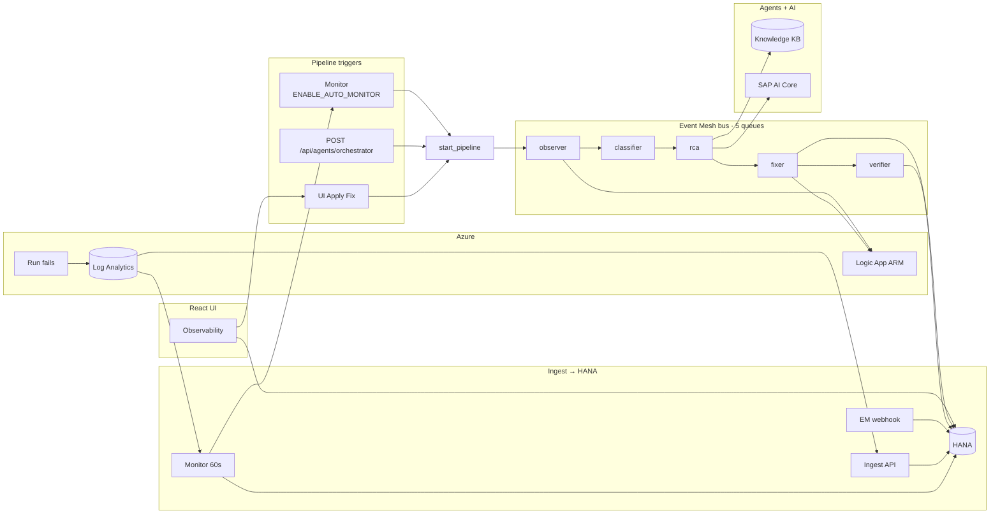

# Logic Apps Auto-Remediation (Orbit Integration Suite)

An end-to-end platform for **detecting**, **observing**, and **auto-remediating** failed **Azure Logic Apps** runs. A FastAPI backend polls Azure Log Analytics (or accepts SAP Event Mesh webhooks), persists incidents in **SAP HANA**, and runs a multi-agent AI pipeline (Observer → Classifier → RCA → Fixer). A React + SAP UI5 web client provides dashboards, observability, pipeline control, and runtime settings.

| Layer | Stack |
|-------|--------|
| Backend | Python 3, FastAPI 0.115, Uvicorn |
| Data | SAP HANA (`hdbcli`), vector knowledge base |
| Cloud | Azure AD, Log Analytics, Logic Apps ARM API |
| AI | SAP AI Core / Generative AI Hub, LangChain, OpenAI SDK |
| Frontend | React 18, Vite 7, SAP UI5 Web Components, Zustand, TanStack Query |
| Optional | SAP Event Mesh webhook ingest, Node `api-server.js` for Log Analytics proxy |

---

## Table of contents

- [Architecture](#architecture)
- [Repository layout](#repository-layout)
- [How it works](#how-it-works)
- [Prerequisites](#prerequisites)
- [Configuration](#configuration)
- [Quick start (local)](#quick-start-local)
- [Running the UI](#running-the-ui)
- [API reference](#api-reference)
- [Frontend routes](#frontend-routes)
- [Utilities](#utilities)
- [Deployment](#deployment)
- [Known limitations](#known-limitations)
- [Troubleshooting](#troubleshooting)

---

## Architecture

**Current architecture (code-verified):** [docs/architecture-current.md](docs/architecture-current.md)  
**Event Mesh queues:** [docs/event-mesh-agent-queues.md](docs/event-mesh-agent-queues.md)


### At a glance



| Layer | What happens |
|-------|----------------|
| **Azure** | Failed runs → **Log Analytics**; workflow definition on **ARM**. |
| **Ingest** | **Monitor** / **ingest API** → **HANA** (`DETECTED`). **EM webhook** → HANA (failures) or queue (pipeline messages). |
| **Triggers** | **Monitor** (if auto-fix on), **Apply Fix** (`start_pipeline`), **orchestrator API** — all publish to **observer** queue. |
| **Pipeline** | **5 in-process queues** + workers: observer → classifier → rca → fixer → verifier. Updates HANA per step (`PIPELINE_*` → `AUTO_FIXED`). |
| **Deploy** | **Fixer** `PUT` workflow via ARM; **Verifier** optional trigger run. |
| **UI** | Polls **`/api/monitor/fix-status`** after `PIPELINE_STARTED`. |

**Incident identity:** Each `run_id` → stable `INCIDENT_ID` (`ORBLOGICAPPS-YYYYMMDD-XXXXXX`) via `RUN_INCIDENT_MAP`. Terminal statuses skip re-processing (`AUTO_FIXED`, `FAILED`, `FIX_SUCCEEDED`, …).

---

## Repository layout

```
logic_app_auto_seirra/
├── client/                 # React UI (orbit-integration-suite-ui)
│   ├── src/
│   │   ├── pages/          # dashboard, observability, pipeline, settings, …
│   │   ├── services/api.ts # HTTP client + Vite proxy targets
│   │   └── components/
│   ├── vite.config.ts      # Dev proxy → localhost:8000
│   └── api-server.js       # Optional Express Log Analytics helper (port 4000)
├── server/                 # FastAPI application
│   ├── main.py             # App entry, background monitor, CORS
│   ├── config.py           # Settings from environment
│   ├── routers/            # HTTP route modules
│   ├── services/agents/    # Observer, Classifier, RCA, Fixer, Orchestrator, Knowledge
│   ├── db/hana_client.py   # HANA persistence + analytics
│   ├── requirements.txt
│   └── Procfile            # Cloud Foundry / PaaS: web: python main.py
├── export_to_csv.py        # Standalone HANA → CSV export script
└── README.md
```

---

## How it works

### 1. Detection

- **Background monitor** (`main.py`): Every **60 seconds**, queries Log Analytics for `AzureDiagnostics` rows where `ResourceProvider == "MICROSOFT.LOGIC"`, `Category == "WorkflowRuntime"`, and `status_s == "Failed"`. Lookback window is `LOOKBACK_HOURS` (default **0.3** hours).
- **Manual ingestion**: `POST /api/ingest/api/ingest/incremental` and `POST /api/ingest/api/ingest/backfill` (see [Known limitations](#known-limitations) for the doubled path prefix).
- **Event Mesh**: `POST /api/event-mesh/webhook` or `POST /api/event-mesh/ingest` for push-based events.

### 2. Remediation pipeline (Orchestrator)

When `ENABLE_AUTO_MONITOR` is `true` (default), each new failure triggers:

1. **Observer** — Resolve failed action, run history, error context from Azure.
2. **Classifier** — Rule-based + LLM error typing.
3. **RCA** — Root-cause analysis via SAP AI Core (with rule-based fallback).
4. **Fixer** — LLM-generated workflow definition patch; optional retry policies for timeouts; deploy via ARM `PUT`.
5. **Tracker** — `remediation_tracker` avoids duplicate fixes and enforces retry limits (`MAX_REMEDIATION_ATTEMPTS`, `TRACKER_MAX_RETRY_COUNT`).

Set `ENABLE_AUTO_MONITOR=false` or `DRY_RUN=true` for ingest-only / safe modes.

### 3. Knowledge base

Microsoft Learn documentation can be scraped, chunked, embedded, and stored in HANA for similarity search (`/knowledge/search`). Used by RCA and Fixer for context-aware fixes.

---

## Prerequisites

| Requirement | Purpose |
|-------------|---------|
| Python 3.10+ | Backend |
| Node.js 18+ | Frontend build & dev |
| SAP HANA Cloud (or on-prem) | Incident + knowledge storage |
| Azure service principal | Log Analytics + Logic Apps ARM |
| SAP AI Core credentials | LLM / embeddings |
| (Optional) SAP Event Mesh | Webhook push ingest |

**Azure permissions (typical):**

- Log Analytics: `Microsoft.OperationalInsights/workspaces/query/read`
- Logic Apps: read/update workflows in the target resource group

---

## Configuration

Create `server/.env` or a repo-root `.env` (loaded by `config.py`). **Never commit secrets.**

### Azure

| Variable | Description |
|----------|-------------|
| `AZURE_TENANT_ID` | Azure AD tenant |
| `AZURE_CLIENT_ID` | Service principal app ID |
| `AZURE_CLIENT_SECRET` | Client secret |
| `AZURE_SUBSCRIPTION_ID` | Target subscription |
| `AZURE_RESOURCE_GROUP` | Logic Apps resource group |
| `LOG_ANALYTICS_WORKSPACE_ID` | Workspace GUID for failed-run queries |

### SAP HANA

| Variable | Default | Description |
|----------|---------|-------------|
| `HANA_HOST` | — | Database host |
| `HANA_PORT` | `443` | Port |
| `HANA_USER` / `HANA_PASSWORD` | — | Credentials |
| `HANA_SCHEMA` | — | Schema name |
| `HANA_OBSERVABILITY_TABLE` | `LOGIC_APPS_OBSERVABILITY` | Incidents table |
| `HANA_TABLE` | `LOGIC_APPS_KNOWLEDGE` | Knowledge chunks table |

### SAP AI Core

| Variable | Description |
|----------|-------------|
| `AICORE_AUTH_URL` | OAuth token URL |
| `AICORE_CLIENT_ID` / `AICORE_CLIENT_SECRET` | AI Core credentials |
| `AICORE_BASE_URL` | API base URL |
| `AICORE_RESOURCE_GROUP` | Resource group |
| `AICORE_CHAT_DEPLOYMENT_ID` | Chat model deployment |
| `EMBEDDING_DEPLOYMENT_ID` | Embedding deployment |
| `VECTOR_DIMENSION` | `3072` (default) |

### Pipeline behaviour

| Variable | Default | Description |
|----------|---------|-------------|
| `LOOKBACK_HOURS` | `0.3` | Log Analytics lookback for monitor |
| `ENABLE_AUTO_MONITOR` | `true` | Auto-remediate after ingest |
| `DRY_RUN` | `false` | Skip mutating fixes when true |
| `MAX_REMEDIATION_ATTEMPTS` | `2` | Orchestrator retry cap |
| `TRACKER_RETENTION_DAYS` | `90` | Local tracker retention |
| `KNOWLEDGE_MICROSOFT_LEARN_URLS` | (built-in list) | Comma-separated scrape URLs |

Runtime overrides (in-memory until restart) are available via **`GET/PATCH /api/settings`** and remediation policies via **`/api/settings/policies`**.

---

## Quick start (local)

### Backend

```powershell
cd server
python -m venv .venv
.\.venv\Scripts\Activate.ps1
pip install -r requirements.txt
# Create .env with Azure, HANA, and AI Core variables
python main.py
```

Server listens on **`http://localhost:8000`** (`PORT` env overrides).

Verify:

- `GET http://localhost:8000/` → service info
- `GET http://localhost:8000/api/monitor/status` → background monitor state
- `GET http://localhost:8000/docs` → OpenAPI (Swagger UI)

### Frontend

```powershell
cd client
npm install
npm run dev
```

UI: **`http://localhost:3000`**. Vite proxies `/api`, `/dashboard`, `/logs`, `/incidents`, etc. to port **8000**.

For production-like API URL, set in `client/.env`:

```env
VITE_API_BASE=https://your-backend.example.com
VITE_LOG_API_BASE=https://your-backend.example.com
```

---

## Running the UI

| Script | Command | Description |
|--------|---------|-------------|
| Dev server | `npm run dev` | Vite on port 3000 |
| Build | `npm run build` | Typecheck + production bundle → `client/dist` |
| Preview | `npm run preview` | Serve production build |
| Optional API helper | `npm run api` | Express Log Analytics proxy (`API_PORT`, default 4000) |

**Shell navigation (sidebar):** Dashboard · Observability · Pipeline · Settings

**Additional routes** (reachable by URL, not in main nav): `/orchestrator`, `/migration`, `/pipo`

---

## API reference

Base URL: `http://localhost:8000` (local). All paths below are verified against the running FastAPI app.

### Core

| Method | Path | Description |
|--------|------|-------------|
| `GET` | `/` | Service name and version (`3.0.0`) |
| `GET` | `/api/monitor/status` | Monitor running, poll interval, cache size |

### Observability & incidents

| Method | Path | Description |
|--------|------|-------------|
| `GET` | `/api/monitor/messages` | Paginated incident list (`limit`, `offset`) |
| `GET` | `/api/monitor/message/{incident_id}` | Incident detail |
| `POST` | `/api/monitor/analyze/{incident_id}` | Trigger RCA |
| `POST` | `/api/monitor/explain/{incident_id}` | LLM error explanation |
| `POST` | `/api/monitor/generate-fix/{incident_id}` | Generate fix plan |
| `POST` | `/api/monitor/apply-fix/{incident_id}` | Apply remediation (`?force=true` optional) |
| `GET` | `/api/monitor/fix-status/{incident_id}` | Fix pipeline status |
| `GET` | `/api/logs/overview` | KPIs, breakdowns, timeline |
| `GET` | `/api/incidents` | Simplified incident list |
| `GET` | `/logs/overview` | Same analytics (root alias for UI proxy) |
| `GET` | `/incidents` | Same list (root alias) |

### Ingestion

| Method | Path | Description |
|--------|------|-------------|
| `POST` | `/api/ingest/api/ingest/incremental` | Incremental Log Analytics ingest |
| `POST` | `/api/ingest/api/ingest/backfill?days=30` | Historical backfill (max 30 days) |
| `GET` | `/api/ingest/api/ingest/health` | Ingest + HANA connectivity |

### Event Mesh

| Method | Path | Description |
|--------|------|-------------|
| `GET` | `/api/event-mesh/webhook` | Webhook handshake |
| `POST` | `/api/event-mesh/webhook` | Receive failure events |
| `POST` | `/api/event-mesh/ingest` | Typed JSON ingest |
| `GET` | `/api/event-mesh/status` | HANA + incident counts |
| `GET` | `/api/aem/status` | Alias → event mesh status |
| `GET` | `/api/aem/incidents` | Recent HANA incidents |

### AI agents

Prefix: `/api/agents`

| Agent | POST | GET |
|-------|------|-----|
| Orchestrator | `/orchestrator` | `/orchestrator/{workflow_name}/{run_id}` |
| Classifier | `/classifier` | `/classifier/{error_code}` |
| RCA | `/rca` | `/rca/{error_type}` |
| Fixer | `/fixer` | — |
| Observer | `/observer` | `/observer/{subscription_id}/{resource_group}/{workflow_name}/{run_id}` |
| Verifier | `/verifier` | `/verifier/{workflow_name}` |
| Knowledge | `/knowledge` | `/knowledge/stats` |
| Health | — | `/health` |

### Workflows (ARM)

Prefix: `/workflows`

| Method | Path | Description |
|--------|------|-------------|
| `GET` | `/{workflow_name}` | Workflow definition |
| `PUT` | `/{workflow_name}` | Update definition |
| `GET` | `/{workflow_name}/runs/{run_id}` | Run details |
| `GET` | `/{workflow_name}/runs/{run_id}/actions` | Run actions |
| `POST` | `/{workflow_name}/triggers/{trigger_name}/run` | Trigger workflow |

### Knowledge base

Prefix: `/knowledge`

| Method | Path | Description |
|--------|------|-------------|
| `GET` | `/` | Service info |
| `GET` | `/search?q=...&top_k=5` | Vector similarity search |
| `GET` | `/stats` | Chunk counts |
| `GET` | `/health/live` | Liveness |
| `GET` | `/health/ready` | Readiness (HANA + embeddings) |

### Settings

Prefix: `/api/settings`

| Method | Path | Description |
|--------|------|-------------|
| `GET` | `/` | List runtime settings |
| `PATCH` | `/{key}` | Override setting |
| `DELETE` | `/{key}/reset` | Reset to default |
| `GET` | `/policies` | Remediation policies by error type |
| `PATCH` | `/policies/{error_type}` | Update policy action |
| `DELETE` | `/policies/{error_type}/reset` | Reset policy |

### Dashboard & stubs

| Method | Path | Description |
|--------|------|-------------|
| `GET` | `/dashboard` | Placeholder (`status: ok`) |
| `GET` | `/api/tickets` | Returns `{ "tickets": [] }` (stub) |
| `GET` | `/api/approvals/pending` | Returns `{ "pending": [] }` (stub) |
| `GET` | `/api/mcp/tools` | Returns `{ "total": 0, "servers": {} }` (stub) |

Interactive docs: **`/docs`** (Swagger), **`/redoc`**.

---

## Frontend routes

| Path | Page | Primary APIs |
|------|------|----------------|
| `/dashboard` | KPIs, charts, incident grid | `/logs/overview`, `/api/monitor/messages` |
| `/observability` | Event mesh flow, message log, RCA/fix actions | `/api/aem/*`, `/api/monitor/*` |
| `/pipeline` | Agent pipeline status & trace | `/api/monitor/status`, `/api/monitor/messages` |
| `/settings` | Runtime settings, policies, themes | `/api/settings`, `/api/event-mesh/status` |
| `/orchestrator` | Chat / orchestration UI | External `/query` when deployed with chat backend |
| `/migration` | Migration wizard (file upload) | `/query` multipart |
| `/pipo` | PIPO-style incident list | `/autonomous/incidents` (see limitations) |

---

## Utilities

### `export_to_csv.py`

Exports all rows from `LOGIC_APPS_OBSERVABILITY` to a timestamped CSV (`hana_export_YYYYMMDD_HHMMSS.csv`). Uses `HANA_*` from `.env`. **Note:** The script hard-codes `SET SCHEMA AI_USE_CASES_HDI_DB_1`; align with your `HANA_SCHEMA` before running.

```powershell
python export_to_csv.py
```

### `client/api-server.js`

Optional Express server that queries Log Analytics directly (requires `AZURE_*` and `LOG_ANALYTICS_WORKSPACE_ID`). Not required when using the Python backend monitor.

---

## Deployment

### Backend (SAP BTP / Cloud Foundry)

`server/Procfile`:

```
web: python main.py
```

Set `PORT` from the platform. Bind `0.0.0.0`. Configure all env vars in the CF/BTP service binding or user-provided service.

Default production API referenced in the UI: `VITE_API_PRIMARY` in `client/src/services/api.ts` (override for your landscape).

### Frontend

```powershell
cd client
npm run build
```

Serve `client/dist` via Staticfile (`client/public/Staticfile` present) or any static host. Point `VITE_API_BASE` / `VITE_LOG_API_BASE` at the deployed backend.

Example Cloud Foundry manifest (`client/manifest.yaml`):

```yaml
applications:
  - name: ND-ORBIT-EventMesh-FE-logicapps
    memory: 2G
    buildpacks:
      - staticfile_buildpack
    path: dist
```

---

## Known limitations

Cross-checked against source and live route registration:

1. **Doubled ingest prefix** — `api_ingest.router` and `main.py` both use `/api/ingest`, so incremental/backfill/health live under `/api/ingest/api/ingest/...`. Use those paths until the router prefix is deduplicated.

2. **UI endpoints not implemented on this backend** — Some client helpers target routes that are **not** registered on this server:
   - `GET /autonomous/incidents` — used by `/pipo` (`fetchPipoDetails`)
   - `POST /api/monitor/start` / `POST /api/monitor/stop` — used by agent-cards start/stop (monitor already auto-starts in `main.py`)
   - `POST /smart-monitoring/chat`, `GET /query`, `GET /get_all_history` — orchestrator chat / migration wizard (separate chat service when deployed)
   - `GET /dashboard/all` — defined in `api.ts` but unused by current pages

   **Working today:** Dashboard (`/logs/overview`, `/incidents`), Observability (`/api/monitor/*`, `/api/aem/*`), Pipeline (`/api/monitor/status`, `/api/monitor/messages`), Settings (`/api/settings`).

3. **Stub APIs** — Tickets, approvals, and MCP tools return empty placeholders.

4. **`export_to_csv.py`** — Schema name is hard-coded; may not match `HANA_SCHEMA`.

5. **Auto-fix toggle in UI** — `fetchAutoFixStatus` / `toggleAutoFix` in `api.ts` are client stubs; real control is `ENABLE_AUTO_MONITOR` env and `/api/settings` (`AUTO_FIX_ENABLED`).

---

## Troubleshooting

| Symptom | Check |
|---------|--------|
| Monitor not processing | `LOG_ANALYTICS_WORKSPACE_ID` set; `GET /api/monitor/status`; Azure SP permissions |
| HANA errors on ingest | `HANA_*` credentials; schema/table exist; `GET /api/ingest/api/ingest/health` |
| No auto-fix | `ENABLE_AUTO_MONITOR=true`; `DRY_RUN=false`; RCA/Fixer logs; confidence thresholds in settings |
| UI cannot reach API | Vite proxy (localhost) or `VITE_API_BASE`; CORS is open (`*`) on backend |
| Duplicate remediation | Terminal status in HANA; in-memory `_processed_runs` cache in `main.py` |
| LLM failures | SAP AI Core env vars; deployment IDs; network from BTP to AI Core |

---

## License

No license file is included in this repository. Add one before external distribution.

---

## Related names

| Name | Where |
|------|--------|
| `auto_remediation_logic_app` | Original repo title |
| `orbit-integration-suite-ui` | `client/package.json` |
| Logic Apps Auto-Remediation API `3.0.0` | `server/main.py` |
